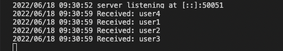
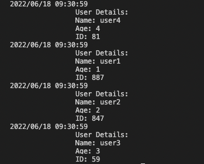
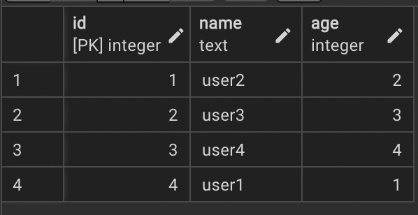

# Go-gRPC-Service 

### Starting

```
$ go install google.golang.org/protobuf/cmd/protoc-gen-go@v1.28
$ go install google.golang.org/grpc/cmd/protoc-gen-go-grpc@v1.2

```
### Don't forget to set the path

```
export PATH="$PATH:$(go env GOPATH)/bin"
```
### Proto command
```
protoc --go_out=. --go_opt=paths=source_relative --go-grpc_out=. --go-grpc_opt=paths=source_relative usermgmt/usermgmt.proto
```
## Server Run
```
go run usermgmt_server/usermgmt_server.go
```

## Client Run
```
go run usermgmt_server/usermgmt_server.go

```

## Server Snapshot

<p>
    

</p>

## Client Snapshot

<p>
    

</p>

## PostgreSQL Snapshot

<p>
    

</p>


#### Moss